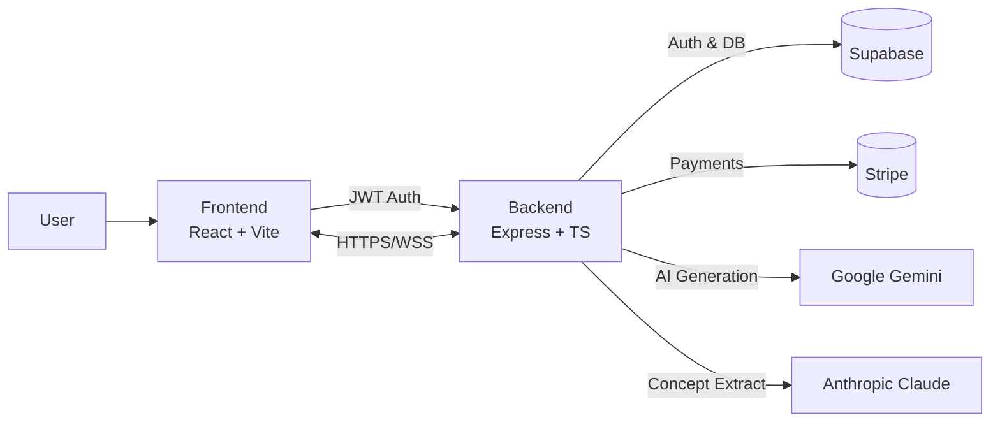

<p align="center">
  
</p>

<p align="center">
  
  
  
  
  
  
</p>

<p align="center">
  <a href="https://your-netlify-site.netlify.app">
    
  </a>
  <a href="https://your-render-service.onrender.com/api/health">
    
  </a>
</p>

<h1 align="center">VizKidd — AI-Powered Educational Visualizer</h1>

<p align="center">
  Transform complex text into elegant, interactive SVG visualizations using Gemini and Claude — with concept extraction, voice Q&A, PDF parsing, secure auth, and a credit system.
</p>

---

## ✨ Features

- **📊 Visualize Anything**: Flowcharts, concept maps, neural networks — clean, precise SVGs
- **📄 Multiple Inputs**: Paste text, upload PDFs, or scrape URLs
- **🎯 Smart Concepts**: Extract key ideas and their positions in text
- **🎙️ Voice Assistant**: Ask contextual questions about your content
- **🔐 Secure by Design**: JWT auth, rate limiting, Helmet, and strict CORS
- **💳 Credit System**: Stripe-powered pay-as-you-go and subscriptions

---

## 🎬 Preview

> Add your screenshots/gifs here to showcase the app

<p align="center">
  
</p>

<p align="center">
  
</p>

<p align="center">
  
</p>

---

## 🧰 Tech Stack

### Frontend
- **React 18** + **TypeScript** - Modern UI framework with type safety
- **Vite** - Lightning-fast build tool
- **TailwindCSS** - Utility-first styling
- **PDF.js** - PDF processing and rendering
- **Web Speech API** - Voice recognition and synthesis
- **Lucide React** - Beautiful icon library

### Backend
- **Express** + **TypeScript** - Robust API server
- **Google Gemini API** - Advanced AI for SVG generation and text processing
- **Anthropic Claude API** - Intelligent concept extraction
- **JWT Authentication** - Secure token-based auth
- **Helmet** + **Rate Limiting** - Security and abuse prevention

### Infrastructure
- **Netlify** - Frontend hosting with CDN
- **Render** - Backend hosting with auto-scaling
- **Supabase** - PostgreSQL database + authentication
- **Stripe** - Payment processing and subscription management

---

## 🗂️ Project Structure

---

## 🧰 Tech Stack

### Frontend
- **React 18** + **TypeScript** - Modern UI framework with type safety
- **Vite** - Lightning-fast build tool
- **TailwindCSS** - Utility-first styling
- **PDF.js** - PDF processing and rendering
- **Web Speech API** - Voice recognition and synthesis
- **Lucide React** - Beautiful icon library

### Backend
- **Express** + **TypeScript** - Robust API server
- **Google Gemini API** - Advanced AI for SVG generation and text processing
- **Anthropic Claude API** - Intelligent concept extraction
- **JWT Authentication** - Secure token-based auth
- **Helmet** + **Rate Limiting** - Security and abuse prevention

### Infrastructure
- **Netlify** - Frontend hosting with CDN
- **Render** - Backend hosting with auto-scaling
- **Supabase** - PostgreSQL database + authentication
- **Stripe** - Payment processing and subscription management

---

## 🗂️ Project Structure

```
Hack_RU_EDU_Visualizer/
├── frontend/                 # React + TypeScript + Vite app
│   ├── src/
│   │   ├── components/       # UI components (auth, layout, common)
│   │   ├── contexts/         # React Context providers
│   │   ├── features/         # Feature modules (concept, voice)
│   │   ├── hooks/            # Custom React hooks
│   │   ├── services/         # API clients (ai, pdf, voice)
│   │   ├── types/            # TypeScript type definitions
│   │   └── utils/            # Helper functions
│   ├── package.json
│   └── vite.config.ts
│
├── backend/                  # Express + TypeScript API
│   ├── src/
│   │   ├── config/           # Environment configuration
│   │   ├── middleware/       # Auth, rate limiting, error handling
│   │   ├── routes/           # API endpoints
│   │   ├── services/         # AI service integrations
│   │   └── types/            # TypeScript types
│   ├── package.json
│   └── tsconfig.json
│
├── supabase/                 # Supabase edge functions
├── netlify.toml              # Frontend deployment config
├── render.yaml               # Backend deployment blueprint
└── README.md                 # This file
```

---

## ⚡ Quick Start

### Prerequisites

- Node.js 18 or higher
- npm or yarn
- Supabase account
- Google Gemini API key
- Anthropic Claude API key
- (Optional) Stripe account for payments

### Frontend Setup

```bash
# Navigate to frontend
cd frontend

# Install dependencies
npm install

# Create environment file
cp .env.example .env

# Edit .env with your configuration
# Then start development server
npm run dev
```

Frontend will be available at `http://localhost:5173`

### Backend Setup

```bash
# Navigate to backend
cd backend

# Install dependencies
npm install

# Create environment file
cp .env.example .env

# Edit .env with your API keys
# Then start development server
npm run dev
```

Backend will be available at `http://localhost:5000`

### Run Both Concurrently

Open two terminal windows and run both services simultaneously for the full experience.

---

## 🔧 Environment Variables

### Frontend (`frontend/.env`)

```env
VITE_SUPABASE_URL=https://your-project.supabase.co
VITE_SUPABASE_ANON_KEY=your-anon-key
VITE_BACKEND_API_URL=http://localhost:5000
VITE_STRIPE_PUBLISHABLE_KEY=pk_test_...
VITE_STRIPE_PRICE_SUBSCRIPTION=price_...
VITE_STRIPE_PRICE_ONETIME=price_...
```

### Backend (`backend/.env`)

```env
PORT=5000
NODE_ENV=development

# Supabase
SUPABASE_URL=https://your-project.supabase.co
SUPABASE_SERVICE_KEY=your_supabase_service_key
SUPABASE_JWT_SECRET=your_supabase_jwt_secret

# AI Services
ANTHROPIC_API_KEY=your_anthropic_key
GEMINI_API_KEY=your_gemini_key

# Stripe
STRIPE_SECRET_KEY=your_stripe_secret_key
STRIPE_WEBHOOK_SECRET=your_stripe_webhook_secret

# CORS
CORS_ORIGIN=http://localhost:5173
```

---

## 🌐 API Overview

**Base URL**: `https://your-render-service.onrender.com/api`

All `/api/ai/*` routes require `Authorization: Bearer <jwt>` header.

### Endpoints

| Method | Endpoint | Description | Auth Required |
|--------|----------|-------------|---------------|
| `GET` | `/health` | Service health check | ❌ |
| `POST` | `/ai/generate-svg` | Generate SVG visualization | ✅ |
| `POST` | `/ai/extract-concepts` | Extract concepts from text | ✅ |
| `POST` | `/ai/extract-concepts-with-ranges` | Extract concepts with positions | ✅ |
| `POST` | `/ai/format-text` | Format text with HTML | ✅ |
| `POST` | `/ai/extract-pdf-text` | Extract text from PDF | ✅ |
| `POST` | `/ai/answer-question` | Answer question with context | ✅ |
| `POST` | `/payments/create-checkout` | Create Stripe checkout session | ✅ |
| `POST` | `/stripe/webhook` | Handle Stripe webhooks | ❌ |

### Example Request

```javascript
// Generate SVG Visualization
POST /api/ai/generate-svg
Authorization: Bearer <your-jwt-token>
Content-Type: application/json

{
  "concept": {
    "title": "Neural Network",
    "description": "A neural network with input, hidden, and output layers"
  },
  "type": "neural-network",
  "model": "gemini"
}
```

---

## 🏗️ Architecture



---

## 🧪 Available Scripts

### Frontend

| Command | Description |
|---------|-------------|
| `npm run dev` | Start Vite dev server with HMR |
| `npm run build` | Build for production |
| `npm run preview` | Preview production build |
| `npm run lint` | Run ESLint |

### Backend

| Command | Description |
|---------|-------------|
| `npm run dev` | Start dev server with hot reload |
| `npm run build` | Compile TypeScript to JavaScript |
| `npm start` | Run compiled production server |
| `npm run lint` | Run ESLint on TypeScript files |

---

## 🚀 Deployment

### Frontend (Netlify)

1. **Connect Repository**
   - Link your GitHub repo to Netlify
   - Set base directory to `frontend`

2. **Build Settings**
   - Build command: `npm run build`
   - Publish directory: `dist`

3. **Environment Variables**
   - Add all `VITE_*` variables in Netlify dashboard
   - See `netlify.toml` for detailed configuration

4. **Deploy**
   - Automatic deployment on every push to main branch

### Backend (Render)

1. **Blueprint Deployment**
   - Use the `render.yaml` file for automatic setup
   - Build command: `cd backend && npm ci --include=dev && npm run build`
   - Start command: `cd backend && npm start`

2. **Environment Variables**
   - Add all backend env vars in Render dashboard
   - See `render.yaml` comments for required variables

3. **Health Check**
   - Configured at `/api/health` endpoint

---

## 💳 Credits & Pricing

| Plan | Credits | Price |
|------|---------|-------|
| **Starter** | 10 credits | Free on signup |
| **Pay-as-you-go** | 5 credits | $5 one-time |
| **Subscription** | 100 credits/month | $20/month |

### Credit Usage

- **Visualize**: 1 credit per generation
- **Regenerate**: 0.5 credit per regeneration

---

## 🎨 Key Features Explained

### 🎯 Smart Concept Extraction
The AI automatically identifies key concepts in your text and highlights them. Click any highlighted concept to generate a visualization.

### 📊 Multiple Visualization Types
- **Concept Maps** - Hierarchical relationships
- **Flowcharts** - Process flows and logic
- **Neural Networks** - ML architecture diagrams
- **Technical Diagrams** - System designs
- **Mindmaps** - Brainstorming and connections

### 🎙️ Voice Assistant
Ask questions about your document using voice commands. The AI maintains conversation context for follow-up questions.

### 🔐 Security Features
- JWT-based authentication
- Rate limiting (10 req/min for AI endpoints)
- CORS protection
- Helmet.js security headers
- API keys stored securely on backend

---

## 🗺️ Roadmap

- [ ] Visualization template gallery
- [ ] Custom color themes
- [ ] Export to PNG/PDF
- [ ] Shareable visualization links
- [ ] Collaborative annotations
- [ ] Support for more AI models
- [ ] Real-time collaboration
- [ ] Accessibility improvements
- [ ] Internationalization (i18n)

---

## 🤝 Contributing

We welcome contributions! Here's how you can help:

1. **Fork the repository**
2. **Create a feature branch**
   ```bash
   git checkout -b feature/amazing-feature
   ```
3. **Make your changes**
   - Follow existing code style
   - Add TypeScript types
   - Write clear commit messages
4. **Test your changes**
   ```bash
   npm run lint
   npm run build
   ```
5. **Submit a pull request**

---

## 🐛 Troubleshooting

### Port Already in Use
```bash
# Frontend
npm run dev -- --port 3000

# Backend
PORT=3001 npm run dev
```

### Environment Variables Not Loading
- Ensure `.env` file is in the correct directory
- Frontend variables must start with `VITE_`
- Restart dev server after changing env vars

### Build Errors
```bash
# Clean install
rm -rf node_modules dist
npm install
npm run build
```

---

## 📚 Documentation

- **[Quick Start Guide](docs/QUICK_START.md)** - Get up and running in 5 minutes
- **[Deployment Guide](docs/DEPLOYMENT.md)** - Deploy to Netlify and Render
- **[Architecture Documentation](docs/architecture_documentation.md)** - Deep dive into the codebase
- **[API Documentation](docs/API.md)** - Complete API reference

---

## 📄 License

This project is licensed under the MIT License - see the [LICENSE](LICENSE) file for details.

---

## 🙏 Acknowledgments

- **[Google Gemini](https://ai.google.dev/)** - Advanced AI for visualization generation
- **[Anthropic Claude](https://www.anthropic.com/)** - Intelligent concept extraction
- **[Supabase](https://supabase.com/)** - Auth and database infrastructure
- **[Stripe](https://stripe.com/)** - Payment processing
- **[React](https://react.dev/)** & **[TypeScript](https://www.typescriptlang.org/)** - Amazing communities

---

## 📞 Support

- 🐛 **Issues**: [Create an issue](https://github.com/your-username/your-repo/issues)
- 💬 **Discussions**: [Join the discussion](https://github.com/your-username/your-repo/discussions)
- 📧 **Email**: support@vizkidd.com

---

<p align="center">
  <strong>If you like this project, consider ⭐ starring it and sharing with a friend!</strong>
  <br/>
  <sub>Built with ❤️ for better education through visualization.</sub>
</p>

<p align="center">
  Made with 💙 by <a href="https://github.com/your-username">Your Team Name</a>
</p>
```
